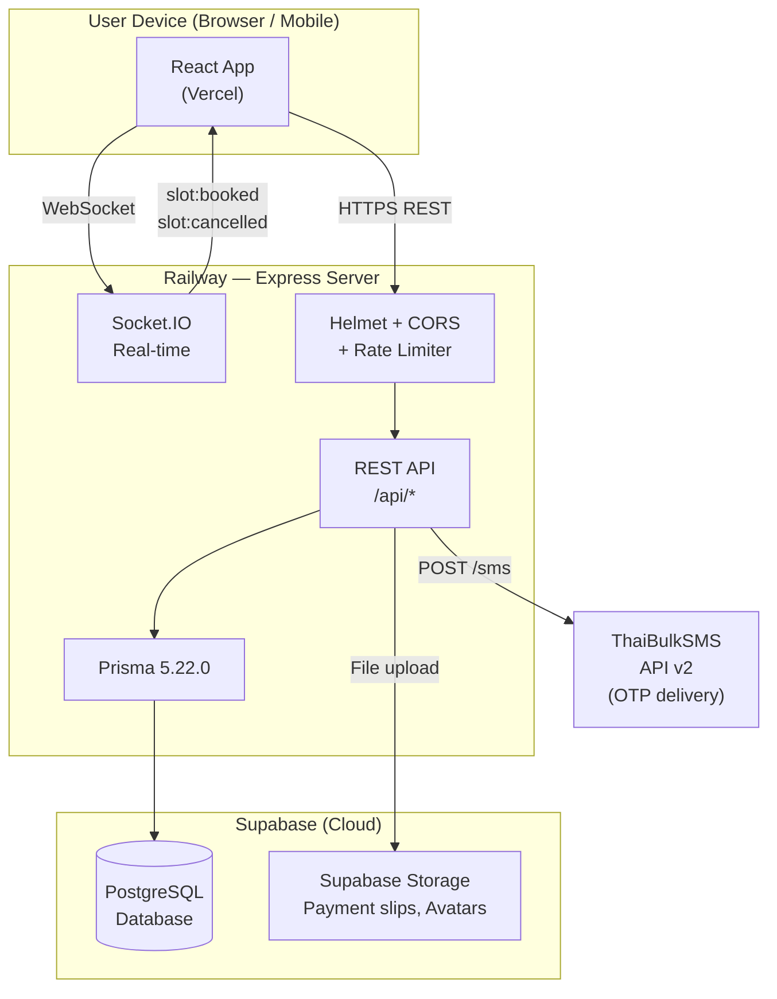

# Product Requirements Document
## Tennis Court Booking Platform

**Version:** 1.2
**Date:** 2026-05-26
**Status:** In Development

**v1.2 changes:** Security hardening complete (Helmet, CORS lockdown, rate limiting, OTP brute-force attempt tracking). ThaiBulkSMS API v2 SMS integration complete — OTP now delivered via real SMS. Deployment architecture decided (Vercel + Railway + Supabase). Redis explicitly decided against (PostgreSQL SSI + provisional system already solves slot conflicts). Tech stack section expanded with architecture diagram. See sections 4, 12, 14, 15, 16.

**v1.1 changes:** Booking flow rewritten to **lock-at-Step-1** model (slot reserved when user clicks "Next" on selection, not at payment submission). Resumable from Upcoming list. Server-authoritative pricing for add-ons. Serializable transactions on POST/confirm-payment/cancel close race conditions. Backend Socket.IO emission shipped. See sections 5.2, 5.1, 7.5, 9, and 18.

---

## 1. Overview

A full-stack web application for managing tennis court reservations at a tennis club. The platform serves two distinct audiences: **regular members** who book courts via a mobile-optimized interface, and **staff** (admins and master admins) who manage operations via a desktop-first admin panel.

The system is built locally and intended to be deployed to Supabase (PostgreSQL in the cloud) when ready. No code changes are needed for that migration — only the `DATABASE_URL` environment variable needs to be swapped.

---

## 2. Goals

- Allow club members to reserve tennis courts online without calling the club.
- Support optional in-house coaching sessions and bring-your-own coach.
- Give admins a real-time view of daily bookings, payments, and court utilization.
- Give master admins a business intelligence view (revenue, top customers, coach earnings).
- Support Thai Baht (฿) payments via bank transfer with slip verification.
- Support Thai and English language switching.

---

## 3. Users & Roles

| Role | Description | Access |
|---|---|---|
| `user` | Club member | Mobile booking interface only |
| `admin` | Club staff | Full admin panel except Business Summary |
| `master_admin` | Club owner / senior staff | Full admin panel including Business Summary |

**Identity:** Phone number is the primary identity. No passwords — authentication is OTP-based.

**Route guards enforce role separation:**
- Regular users landing on `/admin` → redirected to `/`
- Admins/master admins landing on `/` → redirected to `/admin`
- Non-master-admins accessing `/admin/business-summary` → redirected to `/admin`

---

## 4. Authentication Flow

### Registration
1. User submits name + phone (+ optional email/gender/age/occupation/date of birth).
2. Backend creates account and sends OTP to the phone.
3. User enters OTP on `/otp` page to verify and receive a JWT access token + refresh token.

### Login (returning user)
1. User enters phone number.
2. Backend sends OTP.
3. User enters OTP → receives JWT access token + refresh token.

### Token Management
- **Access token:** Short-lived (15 minutes), sent as `Authorization: Bearer <token>` on every request.
- **Refresh token:** Long-lived (30 days), stored in `localStorage`, used to silently obtain a new access token when the current one expires.
- The frontend `api.js` interceptor automatically queues failed 401 requests, refreshes the token, then retries them — users are never interrupted mid-session.
- On logout: refresh token is revoked server-side (deleted from `RefreshToken` table).

### OTP Details
- OTP records are stored in the `OTP` table with an `expiresAt` timestamp.
- Maximum 5 verification attempts per OTP (tracked via `attempts` field, incremented on every wrong guess).
- TTL enforced in code: backend checks `expiresAt < now()` on verification.
- Users can resend OTP via `POST /api/auth/resend-otp`.
- **SMS delivery:** OTP is sent via **ThaiBulkSMS API v2** (`https://api-v2.thaibulksms.com/sms`). Auth is HTTP Basic (API Key + API Secret). Phone numbers are converted from Thai format (`0XXXXXXXXX`) to E.164 (`66XXXXXXXXX`) before sending. Message template: `{APP_NAME}\nYour OTP Code is {otp}\nValid for {N} minutes`. In development (no API keys set), OTP is logged to the server console only — no real SMS is sent, no credits consumed.

---

## 5. User-Facing Features

### 5.1 Home Page (`/`)
- Greeting with user's name and avatar (initials fallback).
- **Credit balance card** — displays available booking credits in Thai Baht (฿).
- **Book Now** button — primary CTA, navigates to `/book`.
- **Upcoming bookings list** — two card types render here:
  - **Confirmed booking card** (green/standard): court number + name, date, time, booking ID, court price, coach card (with active/cancelled/changed status badge), and a **Pay Difference** button when `additionalAmountDue > 0` and `paymentStatus = pending` (triggered by admin coach reassignment to a more expensive coach).
  - **Provisional reservation card** (yellow/amber, turns red < 2 min remaining): "⏱ RESERVED" badge, court + date + time, **live mm:ss countdown** ticking down to the 15-minute expiry, and two CTAs — **Release** (cancels the reservation immediately) and **Continue →** (navigates to `/book?resume=<id>` to finish the flow). Card auto-disappears the moment the countdown reaches zero.
- Language toggle button (EN ↔ TH).
- Hamburger menu: Personal Info, Booking History, Logout.
- **Logout prompt** — if the user has an active provisional reservation when they click Logout, a confirmation modal appears: *"Your reservation for Court X at HH:MM–HH:MM expires in MM:SS. If you log out now, the reservation will be cancelled and the slot released to other users."* with **Stay logged in** and **Cancel & log out** options. Choosing the latter cancels the provisional server-side before clearing the session.

### 5.2 Booking Flow (`/book`) — 3-step wizard with lock-at-Step-1 reservation

**Core design principle:** The slot is reserved (provisional booking created server-side, 15-min countdown starts) the moment the user clicks **"Next →"** on Step 1 (selection). This eliminates the failure mode where a user could see the payment QR code, send money, and discover their slot was taken. From that moment until payment confirmation, the slot is held exclusively for them — visible to everyone else as unavailable.

**One-provisional-per-user rule:** A user may hold at most one active provisional reservation at a time. Attempting to start a second blocks with a clear message and bounces back to Home, where the existing reservation can be continued or released.

**Free navigation:** Once the slot is locked, the user can move forward and back between steps without losing it. The countdown is visible on Steps 2 and 3.

**Resumable:** If the user navigates away (back to Home, closes tab), the provisional stays alive for the remaining countdown and surfaces on the Upcoming list. Tapping **Continue →** on that card returns them to Step 2 of the flow with the same provisional. URL contract: `/book?resume=<bookingId>`.

#### Step 1: Select (Date, Court, Time Slots) — **lock point**
- **Date selector:** Scrollable horizontal list of the next 14 days (configurable via settings).
- **Court selector:** Cards showing each court with name, surface type, price per hour, and photo.
- **Time slot grid:** Available / booked slots for the selected court on the selected date.
  - Slots in the past (for today's date) are automatically greyed out and unclickable.
  - Slots already booked or held by a non-expired provisional show as unavailable.
  - Users can select multiple consecutive hour blocks (max hours enforced by settings, default 4).
  - **Real-time slot updates via Socket.IO:** When another user books or cancels while this user is on the page, slots update instantly. Events emitted by the user's own browser are ignored client-side so the user's own selection is not auto-deselected when their provisional is created.
- **"Next →" button** triggers `POST /api/bookings` with `{ courtId, date, startTime, endTime, duration }`. On success, the provisional booking is created (court price snapshot only — no coach, no add-ons yet) with `expiresAt = now + 15 min`. The user advances to Step 2 with the countdown ticking.
- **Reselection after lock:** If the user returns to Step 1 and changes date/court/time, then clicks Next, a **swap confirmation modal** appears: *"You have a reservation for HH:MM–HH:MM on DD MMM. Continuing will release it and reserve your new selection. A fresh 15-minute timer will start."* On confirm, the backend atomically cancels the previous provisional and creates the new one in a single serializable transaction (single API call: `POST /api/bookings` with `replacePreviousId`).

#### Step 2: Confirm (Coach, Add-ons, Pricing)
- **Countdown banner** at top of page (turns red < 2 min remaining).
- **Coach options:**
  - No coach
  - Outside coach (user brings their own) — incurs a configurable facility fee (default ฿100)
  - In-house coach — shows available coaches filtered by the selected time slot; displays name, nickname, specialization tags, rating, and price per hour.
- **Add-ons section:** Optional items (ball rental, racket rental, towel, water, ball machine) with per-item prices. Enabled/disabled and priced via admin settings.
- **Pricing breakdown:** Court fee, coach fee, outside coach fee, add-ons total, credit discount (if applied), and grand total — all calculated client-side for display.
- **Use Credit checkbox:** If the user has credit, they can apply it to reduce the total. If credits cover 100% of the total, a confirmation modal appears and no payment slip is needed — booking is confirmed immediately via `POST /api/bookings/:id/confirm-payment` (which is also where coach and add-on choices are first sent to the backend).
- **Coach and add-on choices are held in client state.** They are not persisted on the provisional row until Step 3 (confirm-payment). The backend re-derives all prices at that point — no client-supplied prices are trusted.
- The user can navigate back to Step 1 without losing the provisional (countdown continues).

#### Step 3: Payment
- **Countdown banner** at top of page.
- Shows final pricing summary.
- Displays QR code for PromptPay/bank transfer payment (bank name, account number, account name from settings).
- User takes a photo of their payment slip and uploads it.
- On submit:
  1. `POST /api/bookings/:id/confirm-payment` with `{ coachOption, coachId, outsideCoachName, addOns: [{name, quantity}], creditUsed }`. Backend re-derives `courtPrice`, `coachPrice`, `addOnsTotal` from the database (court price was snapshotted at creation; coach price and add-on prices looked up by id/name from the live catalog). Status flips `provisional → confirmed_booking`, credit is debited atomically (see §18.1).
  2. `POST /api/bookings/:id/payment-slip` uploads the image and sets `paymentStatus = submitted`.
  3. User is redirected to `/booking-success/:bookingId`.
- **Expiry handling:** If the 15-min countdown reaches zero before Step 3 submission, a toast appears and the user is bounced back to Step 1 with the slot released. Backend separately rejects any late confirm-payment with `409` (atomic conditional update — see §18.1).

#### Resume flow
- User clicks **Continue →** on the provisional card in Upcoming → browser navigates to `/book?resume=<bookingId>`.
- On mount, BookingFlowPage fetches the booking, validates ownership (`userId === currentUserId`) and that it's still a live provisional (`bookingStatus === provisional && expiresAt > now`), pre-populates `selectedCourt` / `selectedDate` / `selectedSlots` from the booking, and jumps the user directly into Step 2. Coach and add-on selections start fresh (they were never persisted).

### 5.3 Booking Success Page (`/booking-success/:id`)
- Confirmation screen after a successful booking.
- Displays the booking ID and summary.

### 5.4 Booking History (`/history`)
- Full paginated list of the user's **confirmed transactions** (10 per page). Drafts (active or expired provisionals) are intentionally excluded — they're internal scaffolding, not bookings, and surface only on the Upcoming list with their countdown.
- Filter tabs: All, Upcoming, Completed, Cancelled.
- Each booking card shows:
  - Court info (court number, name).
  - Date and time.
  - Booking status badge (upcoming / completed / cancelled / no_show).
  - Payment status badge (pending / submitted / confirmed / refunded / pending_refund).
  - Court price and coach price (separate rows).
  - Coach status badge (active / cancelled / changed) — reflects admin reassignment history.
  - **Cancel button** for upcoming bookings — shows expected refund amount before confirming.
  - **Pay Difference button** — for bookings where admin upgraded the coach and additional payment is owed.

### 5.5 Profile Page (`/profile`)
- Edit name, email, age, gender, date of birth, occupation.
- Upload avatar photo.
- View credit balance.
- Language preference setting.

---

## 6. Admin-Facing Features

All admin pages share a sidebar layout with: Dashboard, Bookings, Courts, Coaches, Users, Settings, and (master admin only) Business Summary.

### 6.1 Admin Dashboard (`/admin`)
**Stats cards:**
- Today's bookings count
- Total bookings (all time)
- Total users
- Active courts
- Pending payments count
- Today's revenue

**Today's Bookings table:** Booking ID, user name, court number, time, booking status, payment status, total price.

### 6.2 Booking Management (`/admin/bookings`)
- Paginated table (15 per page) of all bookings.
- **Filters:** Search (booking ID / user name / phone), booking status, payment status, court, date.
- **Per-booking actions:**
  - **Confirm Payment** — appears when `paymentStatus = submitted`; clicking changes it to `confirmed`. Admin can view the payment slip image link before confirming.
  - **Process Refund** — appears when `status = cancelled` and `paymentStatus = pending_refund`; adds the full amount (cash paid + credits used) back to user's credit balance.
  - **Reassign Coach** — appears for upcoming bookings not awaiting payment. Admin can change the coach assignment (none / in-house / outside). The system calculates the price difference:
    - If new coach is more expensive and payment was already confirmed: `additionalAmountDue` is set on the booking and the user sees a "Pay Difference" button.
    - If new coach is cheaper: the difference is automatically refunded to user's credit.
    - `coachStatus` is updated to `changed` for the user's reference.
  - **Complete** — marks booking as `completed` (for after the session ends).
  - **Cancel** — marks booking as `cancelled`.
  - **No Show** — marks booking as `no_show`.

### 6.3 Court Management (`/admin/courts`)
- View, create, edit, and soft-delete courts.
- Court fields: court number (unique), name, description, surface type (hard/clay/grass/synthetic), price per hour, open time, close time, image.
- Soft-delete: courts are marked `isActive = false` instead of being permanently deleted.

### 6.4 Coach Management (`/admin/coaches`)
- View, create, edit, and soft-delete coaches.
- Coach fields: name, nickname, phone, email, bio, specialization tags (beginner/intermediate/advanced/kids/competition/fitness/strategy), certifications (free text array), years of experience, price per hour, price per session, rating, total reviews, in-house flag, max daily bookings, notes.
- Coach availability: set weekly schedule per day-of-week with start/end times (used to filter available coaches during booking).
- Upload coach avatar photo.
- View coach stats (bookings per month, revenue).

### 6.5 User Management (`/admin/users`)
- View all registered users with search.
- Edit user details and adjust credit balance.
- View user booking history.

### 6.6 Settings (`/admin/settings`)

**Court Operations tab (booking rules):**
| Setting | Default | Description |
|---|---|---|
| `advance_booking_days` | 14 | How many days ahead users can book |
| `min_booking_hours` | 1 | Minimum slot selection |
| `max_booking_hours` | 4 | Maximum slot selection per booking |
| `cancellation_window_hours` | 24 | Hours before booking that cancellation is allowed |
| `outside_coach_fee` | ฿100 | Facility fee charged when user brings an outside coach |

**Add-ons tab:**
Enable/disable and price each add-on: Ball Rental, Racket Rental, Towel, Water, Ball Machine.

**Payment tab:**
Bank name, account number, account name, payment instructions — displayed to users on the payment step QR screen.

### 6.7 Business Summary (`/admin/business-summary`) — master admin only
Period selector: Week / Month / Year.
- **Revenue overview:** Total revenue, total bookings, new users, average revenue per booking.
- **Bookings by status** breakdown.
- **Court utilization:** Total hours booked and booking count per court.
- **Coach revenue:** Revenue and sessions per coach.
- **Top customers:** Ranked by total spend with booking count.
- **Daily revenue bar chart:** Visual revenue trend for the selected period.

---

## 7. Booking State Machines

### 7.1 Booking Lifecycle Status (`status`)
```
upcoming → completed
upcoming → cancelled
upcoming → no_show
```

### 7.2 Provisional Status (`bookingStatus`)
```
provisional (15-min timer) → confirmed_booking
provisional → cancelled (user releases, swap, or logout-with-cancel)
provisional (expired) → ignored at query time (filtered out of /upcoming and /history)
```
A provisional booking is created at the end of Step 1 (selection) and holds the slot for 15 minutes. Coach and add-on details are NOT on the provisional row — they arrive at `confirm-payment` time when the row is upgraded to `confirmed_booking`. If the user does not confirm within 15 minutes, the slot is released automatically (queries filter on `expiresAt > now()`); no background job is required.

**Provisional cap:** Each user may hold at most **one** non-expired provisional at any time. Attempting to create a second returns `409` with `code: HAS_PROVISIONAL`. The exception is **swap** — sending `replacePreviousId` on `POST /api/bookings` atomically cancels the named previous provisional and creates the new one in a single serializable transaction.

### 7.3 Payment Status (`paymentStatus`)
```
pending → submitted (user uploads slip)
submitted → confirmed (admin verifies)
submitted → pending_refund (admin cancels booking while slip was submitted — cash was sent)
pending_refund → refunded (admin processes cash refund as credits)
confirmed → pending_refund (admin cancels after payment confirmed)
pending → refunded (admin cancels while no payment was made — credit-only refund)
```

### 7.4 Coach Status (`coachStatus`)
Tracks coach reassignment history for the user's reference:
- `active` — coach is as originally booked
- `cancelled` — admin removed the coach (difference refunded to user credit)
- `changed` — admin swapped to a different coach

---

## 8. Pricing Model

```
Court Price   = court.pricePerHour × hours
Coach Price   = coach.pricePerHour × hours   (in-house only)
Outside Fee   = settings.outside_coach_fee   (flat, if coachOption = outside)
Add-ons Total = sum of selected add-on prices
─────────────────────────────────────────────
Subtotal      = Court + Coach + Outside Fee + Add-ons
Credit Used   = min(user.credit, subtotal)   (if user opts in)
Total Due     = Subtotal − Credit Used
```

If `Total Due = 0`, no payment slip is required — booking is confirmed immediately via credit deduction.

---

## 9. Real-Time Features (Socket.IO)

The frontend already connects to a Socket.IO server and handles real-time slot events during booking. When a user is on the booking page with a court and date selected:

- The client joins a room: `join:court` with `{ courtId, date }`.
- When another user books a slot: `slot:booked` event → mark slot unavailable + deselect if already selected.
- When another user cancels: `slot:cancelled` event → mark slot available again.
- Client leaves the room on navigation away.

**Status:** Backend Socket.IO emission complete. Every emitted event includes the originating `userId` so the originating browser can skip its own event (otherwise its own selection would be cleared client-side when it creates its own provisional). Emitted from: `POST /api/bookings` (slot:booked), `PUT /api/bookings/:id/cancel` (slot:cancelled), `PUT /api/admin/bookings/:id/status` when status='cancelled' (slot:cancelled).

---

## 10. Data Model Summary

| Table | Key Fields |
|---|---|
| `User` | id (CUID), phone (unique), name, role, credit, preferredLanguage, isActive |
| `RefreshToken` | token (unique), userId, expiresAt |
| `Court` | id, courtNumber (unique), name, surface, pricePerHour, openTime, closeTime, isActive |
| `Coach` | id, name, nickname, specialization[], certifications[], pricePerHour, maxDailyBookings, isActive |
| `CoachAvailability` | id, coachId, dayOfWeek (0–6), startTime, endTime |
| `Booking` | id, bookingId (BK format), userId, courtId, coachId, date, startTime, endTime, duration, status, bookingStatus, paymentStatus, coachOption, coachStatus, courtPrice, coachPrice, addOnsTotal, subtotal, creditUsed, totalPrice, additionalAmountDue, addOns (JSON), paymentSlip, expiresAt |
| `OTP` | id, phone, otp, expiresAt, verified, attempts |
| `Setting` | id, key (unique), value (JSONB), category |

---

## 11. API Structure

| Prefix | Route File | Purpose |
|---|---|---|
| `/api/auth` | routes/auth.js | register, login, verify-otp, resend-otp, me, refresh, logout |
| `/api/users` | routes/users.js | profile update, avatar upload, credit query, language preference |
| `/api/courts` | routes/courts.js | CRUD, soft-delete |
| `/api/coaches` | routes/coaches.js | CRUD, avatar upload, availability schedule, monthly stats |
| `/api/bookings` | routes/bookings.js | available slots, available coaches, create (with optional `replacePreviousId` for atomic swap), confirm-payment (accepts coach+addons; server re-derives prices), payment-slip, upcoming (filters expired provisionals), history (confirmed only), cancel |
| `/api/admin` | routes/admin.js | dashboard, today-bookings, bookings (full list + filters), confirm-payment, update-status, process-refund, reassign-coach, users, business-summary |
| `/api/settings` | routes/settings.js | get all, get public (no auth), update, bulk-upsert, delete |

---

## 12. Tech Stack

### Layer Summary

| Layer | Technology | Notes |
|---|---|---|
| **Frontend** | React 18, React Router v6, Axios, react-hot-toast, date-fns, react-i18next (EN/TH), Socket.IO client | Mobile-optimised user UI |
| **Backend** | Node.js 22, Express.js, Prisma 5.22.0, Socket.IO server | All business logic lives here |
| **Database** | PostgreSQL 17 (local dev), Supabase PostgreSQL (production) | Same Prisma schema — only `DATABASE_URL` changes |
| **ORM** | Prisma 5.22.0 | Do NOT upgrade to Prisma 7 — see note below |
| **Auth** | JWT (access 15m + refresh 30d with rotation), OTP via ThaiBulkSMS | Refresh tokens stored in DB with revocation |
| **SMS** | ThaiBulkSMS API v2 | OTP delivery; Basic Auth; E.164 phone format |
| **File Uploads** | Multer → `lib/storage.js` abstraction | Local disk (dev); swap to Supabase Storage (prod) — only `storage.js` changes |
| **Real-time** | Socket.IO | Slot availability updates on booking/cancel |
| **Security** | Helmet (HTTP headers), express-rate-limit (global 200/15min + auth 10/15min), CORS origin whitelist | Applied globally in `server.js` |

### Deployment Architecture

| Service | Provider | Role |
|---|---|---|
| Frontend hosting | **Vercel** (free tier) | Serves React build; auto-deploys on `git push` |
| Backend hosting | **Railway** (free starter) | Runs Express server; auto-deploys on `git push` |
| Database | **Supabase** (free tier) | Hosted PostgreSQL; 500 MB DB; swap `DATABASE_URL` |
| File storage | **Supabase Storage** (free tier) | 1 GB; replaces local `uploads/` folder |
| SMS | **ThaiBulkSMS** | Per-SMS credit model |

### Architecture Diagram



> **Prisma version lock:** Do not run `npm i prisma@latest`. Prisma 7 requires `prisma.config.ts` + driver adapters and breaks the current setup. Prisma 5.22.0 is locked.

> **Why no Redis:** PostgreSQL Serializable Snapshot Isolation (SSI) + the provisional booking system already handle slot conflicts correctly for a single-server deployment. Redis would add infrastructure complexity without solving any current problem. Re-evaluate only if Railway scales to multiple instances.

> **Why no Supabase Auth:** The platform uses a custom OTP auth system (phone-based, Thai-formatted numbers, JWT with DB-stored refresh tokens). Supabase Auth would add redundancy without benefit. Supabase is used only as a PostgreSQL host and file storage.

---

## 13. Internationalization (i18n)

- Two languages: English (`en`) and Thai (`th`).
- Language preference stored on the user record (`preferredLanguage`).
- Toggle button on the home page switches language instantly without page reload.
- Admin panel is not translated (English only).

---

## 14. Current Implementation Status

### Complete
- [x] Full database migration: MongoDB/Mongoose → PostgreSQL/Prisma
- [x] All 7 database tables created and seeded
- [x] Auth routes: register, login, OTP verify/resend, me, refresh, logout
- [x] All user routes (profile, avatar, credit, language)
- [x] All court routes (CRUD, soft-delete)
- [x] All coach routes (CRUD, avatar, schedule, stats)
- [x] All booking routes (slots, coaches, create, confirm, slip, upcoming, history, cancel)
- [x] All admin routes (dashboard, bookings management, users, business summary)
- [x] Settings routes (CRUD, bulk upsert, public endpoint)
- [x] Frontend: all 13 pages implemented
- [x] Frontend: refresh token auto-retry interceptor
- [x] Frontend: Socket.IO client integration (slot:booked, slot:cancelled events)
- [x] Frontend: i18n (EN/TH)
- [x] Frontend: credit system (use credits to pay, zero-total flow)
- [x] Frontend: coach reassignment flow (Pay Difference modal)
- [x] Frontend: refund flow display
- [x] Seeded test accounts (master_admin, admin, user)

### Complete (v1.1 additions)
- [x] **Lock-at-Step-1 booking flow** — provisional created at "Next →" click, not at payment submission
- [x] **Resumable provisionals** — `/book?resume=<id>` deep link, Continue/Release CTAs on Upcoming card
- [x] **Live countdown** — visible on Upcoming card, Step 2, and Step 3; auto-redirects/dismisses on expiry
- [x] **Atomic swap** — `replacePreviousId` on `POST /api/bookings` in a single serializable transaction
- [x] **1-provisional-per-user cap** — backend enforces via count + `HAS_PROVISIONAL` error code
- [x] **Logout prompt** — confirms before cancelling an active provisional
- [x] **Server-authoritative add-on pricing** — `Setting` table looked up by name; client-sent `price` ignored
- [x] **Confirm-payment race protection** — atomic conditional update prevents double credit debit
- [x] **Cancel race protection** — atomic conditional update prevents double refund
- [x] **Socket.IO backend emission** — `slot:booked` on create, `slot:cancelled` on cancel (both user-tagged)
- [x] **History filter** — excludes provisionals; shows only confirmed transactions
- [x] **`_id` aliasing middleware** — all backend responses auto-aliased for frontend's MongoDB-convention compatibility

### Complete (v1.2 additions)
- [x] **ThaiBulkSMS integration** — OTP delivered via real SMS; E.164 phone conversion; dev-mode console fallback; error-mapped HTTP responses
- [x] **Helmet** — HTTP security headers applied globally (`server.js`)
- [x] **CORS lockdown** — restricted to `FRONTEND_URL` env var (localhost in dev, Vercel URL in prod)
- [x] **Global rate limit** — 200 requests / 15 min / IP on all routes
- [x] **Auth rate limit** — 10 requests / 15 min / IP on `/login`, `/register`, `/verify-otp`, `/resend-otp`
- [x] **OTP brute-force tracking** — `attempts` incremented on every wrong guess; blocks at 5; response shows remaining attempts
- [x] **`imagesPdf` MIME hardening** — `lib/storage.js` filter now checks both file extension AND `mimetype` (previously extension-only)
- [x] **`.gitignore`** — covers `node_modules`, `.env`, `uploads/`, build output, editor files, OS files

### Pending / In Progress
- [ ] **QR code image** — `PAYMENT_QR_IMAGE = null` in `PendingPaymentModal.js`; wire to static asset or settings once the QR image is available
- [ ] **File storage (cloud)** — currently local filesystem (`backend/uploads/`); migrate to Supabase Storage before production — only `lib/storage.js` needs to change (`getUploader` + `getFilePath`)
- [ ] **Admin panel** — full admin UI not yet built (backend routes complete; frontend pages pending)
- [ ] **Supabase migration** — swap `DATABASE_URL` to Supabase PostgreSQL URI when ready to deploy; run `prisma migrate deploy`

---

## 15. Known Issues & Watch Points

| Issue | Detail |
|---|---|
| `_id` field compatibility | Solved by `middleware/aliasId.js` — recursively adds `_id = id` to all response objects globally |
| OTP expiry | No DB TTL index (PostgreSQL has no native TTL). Expiry enforced in code via `expiresAt < now()` check |
| Static `/uploads` XSS | Uploads served on same origin as API. Mitigate by migrating to Supabase Storage (separate domain) before scale |
| `psql` not in PATH | Use full path: `C:\Program Files\PostgreSQL\17\bin\psql.exe` |
| Prisma version lock | Never run `npm i prisma@latest` — Prisma 7 breaks the setup (requires `prisma.config.ts` + driver adapters) |
| QR Code | `PAYMENT_QR_IMAGE = null` in `PendingPaymentModal.js` — placeholder shown until real QR image asset is provided |
| File upload storage | Payment slips and avatars stored on local disk — not suitable for cloud. `lib/storage.js` is the migration point |
| ThaiBulkSMS sender name | Use `"Demo"` on trial account. Switch to an approved sender name before go-live (set `THAIBULKSMS_SENDER` in `.env`) |

---

## 16. Planned Enhancements (Future Scope)

- **Push notifications** — notify users when their payment is confirmed or coach is reassigned.
- **Court images from settings** — allow admins to upload court images via the admin panel instead of via code.
- **Recurring bookings** — allow members to book the same court/time weekly.
- **Rating & reviews** — allow users to rate coaches after completed sessions.
- **Waitlist** — allow users to join a waitlist when a time slot is full.
- **Supabase Storage migration** — move `uploads/` to cloud storage; `lib/storage.js` is the single swap point.
- **Redis (conditional)** — add only if Railway scales to multiple backend instances; use for shared rate-limit counters and OTP storage with automatic TTL. Not needed for single-instance deployment.

---

## 17. Test Accounts (Development / Seed Data)

| Role | Phone | Notes |
|---|---|---|
| master_admin | 0800000001 | Full access including Business Summary |
| admin | 0800000002 | Court/coach/booking management |
| user | 0891234567 | Regular user with ฿500 credit |

Reseed at any time with:
```bash
npm run seed
```
(in the `backend/` directory)

---

## 18. Race & Abuse Protection (Booking Money Path)

These three defences run on every request that touches money or court inventory. Each closes a specific failure mode found in the v1.0 implementation. Tests are documented in `backend/routes/bookings.js` comments; all three are verified end-to-end with concurrent curl requests.

### 18.1 Serializable transaction on `POST /api/bookings`
- The conflict check (does this slot already have a non-cancelled, non-expired booking?) and the `INSERT` are wrapped in `prisma.$transaction(..., { isolationLevel: Prisma.TransactionIsolationLevel.Serializable })`.
- PostgreSQL Serializable Snapshot Isolation (SSI) guarantees that two concurrent requests for the same slot cannot both succeed — one will be aborted with code `P2034` (serialization_failure) and translated to HTTP 409 by the route. The in-transaction conflict check (a deliberate `throw new Error('SLOT_CONFLICT')` when a conflict is found) handles the non-racing case.
- **Why it matters:** Without this, two simultaneous bookings for the same slot could both pass a read-then-write check and both succeed.

### 18.2 Atomic conditional update on `POST /api/bookings/:id/confirm-payment`
- Uses `prisma.booking.updateMany({ where: { id, userId, bookingStatus: 'provisional', expiresAt: { gt: now } }, data: { ... } })`.
- If two simultaneous confirm-payment requests arrive (double-tap, slow network), the first changes `bookingStatus` to `confirmed_booking` — the second's `updateMany` matches zero rows and returns `409`. Credit decrement runs only after a successful match, so it can never be applied twice.
- **Why it matters:** Without this, a double-tap on Pay could debit the user's credit twice for a single booking.

### 18.3 Atomic conditional update on `PUT /api/bookings/:id/cancel`
- Same shape as 18.2: `updateMany` with a guard clause (`status NOT IN ('cancelled', 'completed') AND paymentStatus NOT IN ('pending_refund', 'refunded')`) on the WHERE. First cancel wins; subsequent cancels match zero rows.
- Credit refund is then applied via `{ credit: { increment } }` only when the conditional update succeeded.
- **Why it matters:** Without this, two simultaneous cancel requests could double-refund the user.

### 18.4 Server-authoritative pricing (add-on tampering defence)
- `POST /api/bookings/:id/confirm-payment` accepts `addOns: [{ name, quantity }]` from the client. Any `price` field on those items is ignored.
- Backend builds a name → price lookup from `Setting` rows where `category = 'add_ons'` and `value.available !== false`, then computes each line item's total from the catalogue. Unknown names are silently dropped.
- Coach price and outside-coach fee are likewise re-derived from `Coach.pricePerHour × duration` and `Setting('outside_coach_fee')` respectively. Court price is snapshotted at provisional creation time (so admin price changes during the 15-min window do not retroactively affect the user's quote).
- **Why it matters:** Without this, a user could DevTools-edit the request to submit `{ name: "Ball Rental", price: -10000 }` and receive credit instead of being charged.

### 18.5 Provisional cap (denial-of-inventory defence)
- Each user is allowed at most one non-expired `bookingStatus = provisional, status = upcoming` row at any time.
- Enforced in `POST /api/bookings` via a `count()` query before the create transaction. Exception: when `replacePreviousId` is sent, the named previous provisional is excluded from the count (the create will cancel it atomically inside the same transaction).
- Returns `409` with `code: HAS_PROVISIONAL` and a user-readable message that bounces the frontend back to Home, where Continue / Release CTAs on the provisional card are visible.
- **Why it matters:** Without this, a malicious or careless user could lock every peak slot by holding many simultaneous reservations.

### 18.6 Socket event ownership tag
- Every emitted `slot:booked` / `slot:cancelled` event includes a `userId` field identifying the actor.
- The frontend `markBooked` handler in `BookingFlowPage` skips events where `userId === currentUserId` so the user's own browser does not auto-deselect their own selection when their provisional is created.
- **Why it matters:** Without this, the user's price summary collapses to ฿0 the moment they click Next, because their socket handler clears their selectedSlots state.
